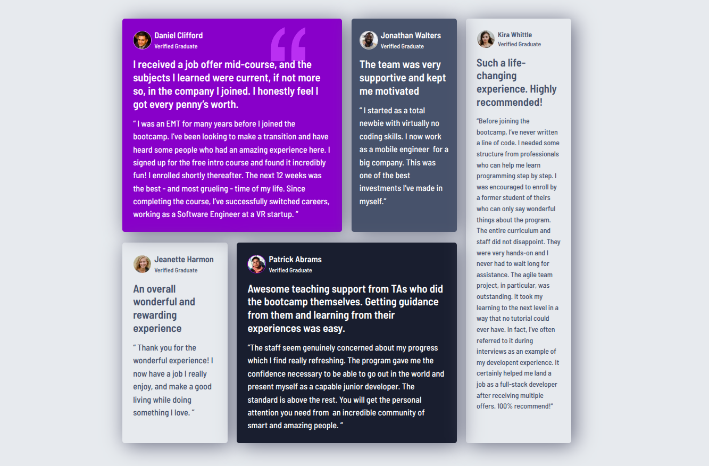

# Frontend Mentor - Testimonial grid section solution

This is a solution to the [Testimonial grid section on Frontend Mentor](https://www.frontendmentor.io/challenges/testimonials-grid-section-Nnw6J7Un7). Frontend Mentor challenges help you improve your coding skills by building realistic projects. 

## Table of contents

- [Overview](#overview)
  - [The challenge](#the-challenge)
  - [Screenshot](#screenshot)
  - [Links](#links)
- [My process](#my-process)
  - [Tools used](#tools-used)

## Overview

### The challenge

The challenge is to build out this testimonials grid section and get it looking as close to the design as possible.

You can use any tools you like to help you complete the challenge. So if you've got something you'd like to practice, feel free to give it a go.

Your users should be able to:

- View the optimal layout for the site depending on their device's screen size

### Screenshot

### Links

- Solution URL: [Frontend Mentor](https://www.frontendmentor.io/solutions/bootstrap-studio-recipe-page-aOpsVoQRKG)
- Live Site URL: [CloudFlare Pages](https://testimonials-grid-section-9so.pages.dev/)

## My process

1. Visually designed in Bootstrap Studio using a Mobile-first workflow
2. HTML and assets exported and edited in VS Code

### Tools used

- [Bootstrap](https://getbootstrap.com/) - CSS Framework
- [Bootstrap Studio](https://bootstrapstudio.io/) - Cross-Platform Design Software
- [GIMP](https://www.gimp.org/) - Free & Open Source Image Editor